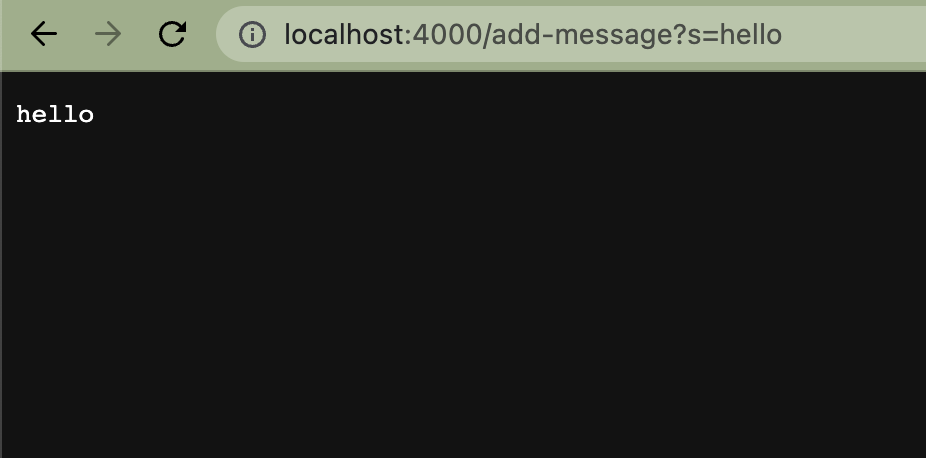
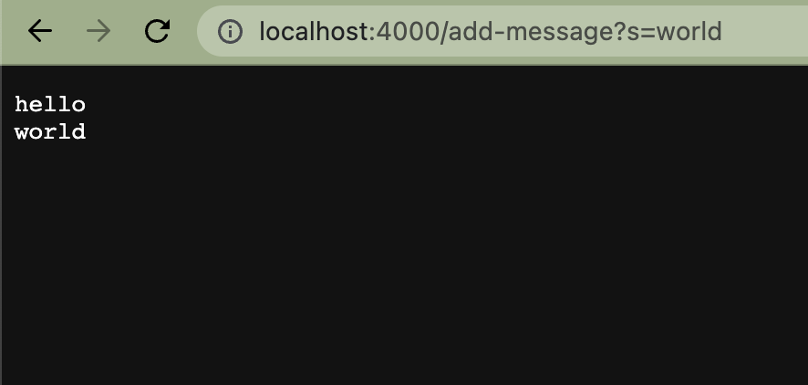
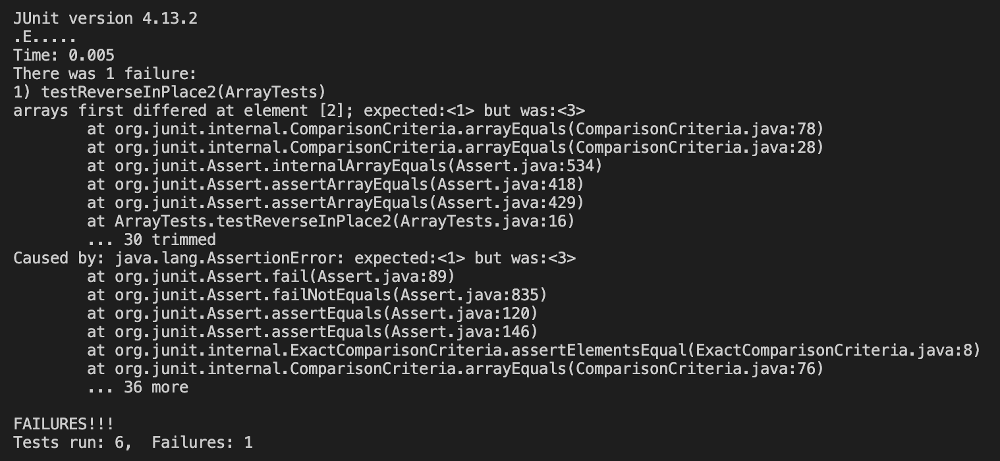
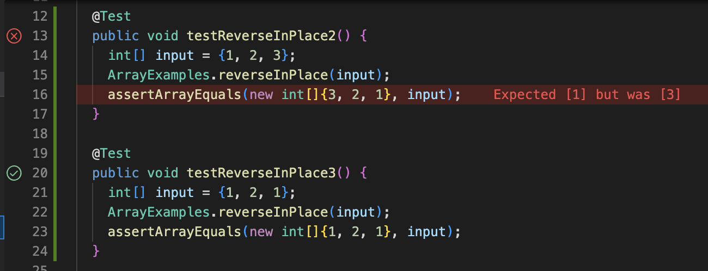

# LAB REPORT 2

## PART 1 ##

### StringServer.java code ###
```
import java.io.IOException;
import java.net.URI;

class Handler implements URLHandler {
    StringBuilder message = new StringBuilder();
    public String handleRequest(URI url) {
        if (url.getPath().equals("/")) {
            return message.toString();
        } else {
            System.out.println("Path: " + url.getPath());
            if (url.getPath().contains("/add-message")) {
                String[] parameters = url.getQuery().split("=");
                if (parameters[0].equals("s")) {
                    message.append(parameters[1] + "\n");
                    return message.toString();
                }
            }
            return "404 Not Found!";
        }
    }
}

class NumberServer {
    public static void main(String[] args) throws IOException {
        if(args.length == 0){
            System.out.println("Missing port number! Try any number between 1024 to 49151");
            return;
        }

        int port = Integer.parseInt(args[0]);

        Server.start(port, new Handler());
    }
}
```
### Running the Server ###



First, NumberServer.java is called, which runs the main method. The main method makes a call to Server, which was given in the starter code for Lab 2. The Server.java file contains a URLHandler interface, ServerHttpHandler class, and Server class, taking advantage of Java's built in HttpServer. The Server class creates a new HttpServer object and starts it, which creates the web server that we are able to see. 

Back in the StringServer.java file, a StringBuilder object ```message``` is created and method handleRequest() is called, which takes in the server URL as a URI object and analyzes it. The URL is analyzed in two different pieces: the path and the query. The path (after the hostname and before the  "?") is checked to see if contains any instruction/strings of relevance; in this case, searching for "add-message." If the path contains the previous string, it will then search the query (after the "?") for the string to add to the message field, as well as a new line ```\n``` to start the next added string on a following line.




This screenshot carries out very similarly to the previous one; the only difference here is in the URI value and message field value that is changed. The query is changed in the server URL, and the entered/to-be-added string is changed (the part following the ```s=```). Additionally, in the message field, instead of replacing the current value in the StringBuilder object, it adds another string and new line.

## PART 2 ##

Looking at the ArrayExamples.java method, the reverseInPlace() method has a bug. The methoud should take an array and reverse all the items in it. For example, an input of {1, 2, 3} should output {3, 2, 1}.

### Failure inducing input ###

```
@Test 
public void testReverseInPlace2() {
    int[] input = {1, 2, 3};
    ArrayExamples.reverseInPlace(input);
    assertArrayEquals(new int[]{3, 2, 1}, input);
}
```

### Input that doesn't induce a failure ###

```
@Test 
public void testReverseInPlace3() {
    int[] input = {1, 2, 1};
    ArrayExamples.reverseInPlace(input);
    assertArrayEquals(new int[]{1, 2, 1}, input);
}
```

### Symptom ###




As shown above, the first test, which tests the input array {1, 2, 3} differs at index 2, where 1 is expected but 3 is the actual result.
The second test, however, which tests the input aray {1, 2, 1} works as expected.

### Bug ###

Before:
```
static void reverseInPlace(int[] arr) {
    // int[] temp = new int[arr.length];
    for(int i = 0; i < arr.length; i += 1) {
      arr[i] = arr[arr.length - i - 1];
    }
    // for(int i = 0; i < arr.length; i++){
    //   arr[i] = temp[i];
    // }
  }
 ```
 
 After:
 ```
static void reverseInPlace(int[] arr) {
    int[] temp = new int[arr.length];
    for(int i = 0; i < arr.length; i += 1) {
      temp[i] = arr[arr.length - i - 1];
    }
    for(int i = 0; i < arr.length; i++){
      arr[i] = temp[i];
    }
  }
 ```
 
The bug here is that while making changes to the array, the first half gets overwritten and the elements are erased, so when reassigning values to the second half, the program can only copy the overwritten values. Notice that testing {1, 2, 3} failed, but {1, 2, 1} passed. To fix this, make a temporary array to hold the values, reverse copy the elements from the input array to the temporary, and then reassign elements from the temporary to the input (and returned) array.

## PART 3 ##

In the Week 2 Lab, I learned all the processes involved in creating a basic server, both on a local and remote host. Previous to this lab, I hadn't had any experience with this at all, so I was able to familiarize myself with making a server, running basic commands/methods, and figuring out how to run it on my computer and even across remotely. I also discovered that using a remote host, when multiple people run the same server and commands, the program saves the changes onto the remote server and all users are able to see any new modifications and changes. For the Week 3 Lab, much of the information about JUnit and testing I had just been taught in CSE 12, so the content wasn't incredibly new. I was able to observe that some bugs within programs are very easy to overlook however, especially without thorough testing.
