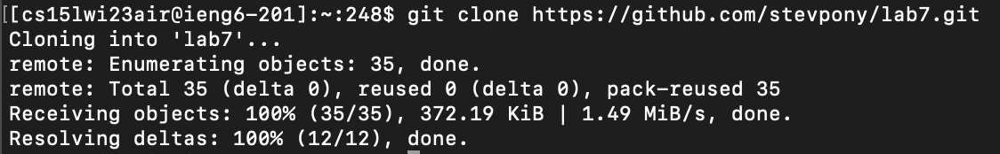
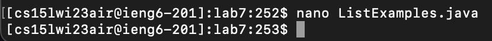
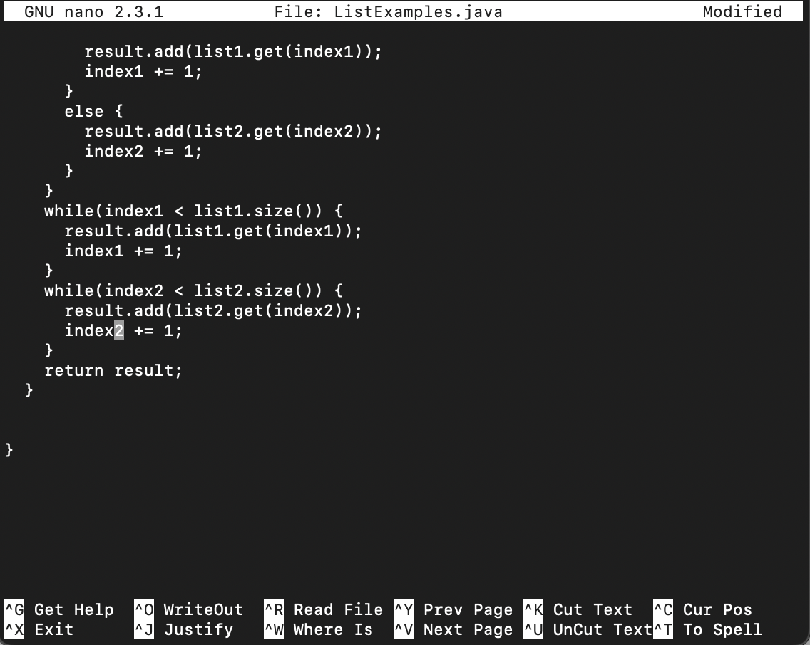
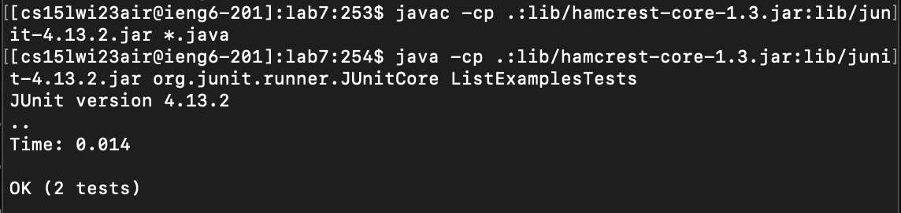

# LAB REPORT 4 #

### STEP 4 ###


#### Keys pressed: ####

ssh cs15lwi23air@ieng6.ucsd.edu ```<enter>```
- I typed out the login command to the ieng6 server. I was automatically logged in, since I had set up a key previously.

### STEP 5 ###



#### Keys pressed: ####

git clone ```<command V> <enter>```

_The link from forked repository was already copied, so I simply pasted it into the terminal to clone it._

### STEP 6 ###


#### Keys pressed: ####
cd la```<tab><enter>```

_I moved into the lab7 directory, typed "la" and pressed tab to autocomplete the path_

```<up><up><up><up><up><up><up><up><up><up><up><enter>```

_I ran the command to compile all .java files, which was 11 commands up._

```<up><up><up><up><up><up><up><up><up><up><enter>```

_I ran the command to run the ListExamplesTests file, which was 10 commands up._

### STEP 7 ###




#### Keys pressed: ####
nano ListExamples.java

_I opened editor for ListExamples.java file._

```<right><right><right><right><right><right><right><right><right><right><right><right><delete>```2

_I scrolled down to the error, moved right 12 times with the arrow keys, deleted the "1" and typed in "2" to fix the error._

```<^X>``` Y ```<enter>```

_I used control X to exit the editor, pressed Y (yes) to save changes, and pressed enter to confirm._

### STEP 8 ###



#### Keys pressed: ####
```<up><up><up><enter>```

_I ran the command to compile all .java files, which was 3 commands up._

```<up><up><up><enter>```

_I ran the command to run the ListExamplesTests file, which was 3 commands up._

### STEP 9 ###


#### Keys pressed: ####
git add ListExamples.java ```<enter>```

_I added changed file to be committed ```<enter>```._

git commit -m "Fixed error in merge method"
_I committed changes with message "Fixed error in merge method"._
