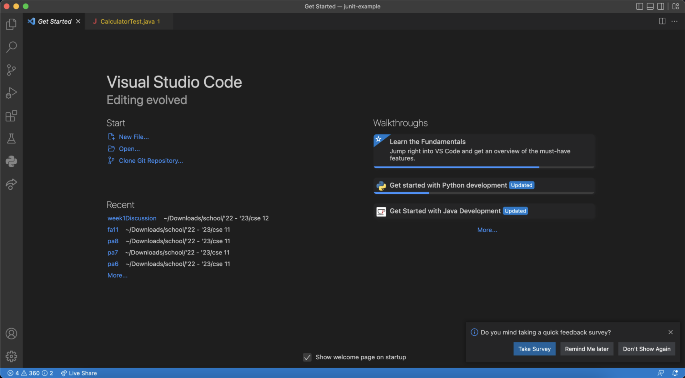
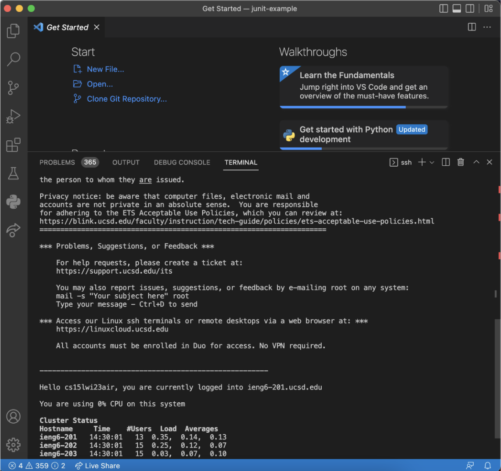
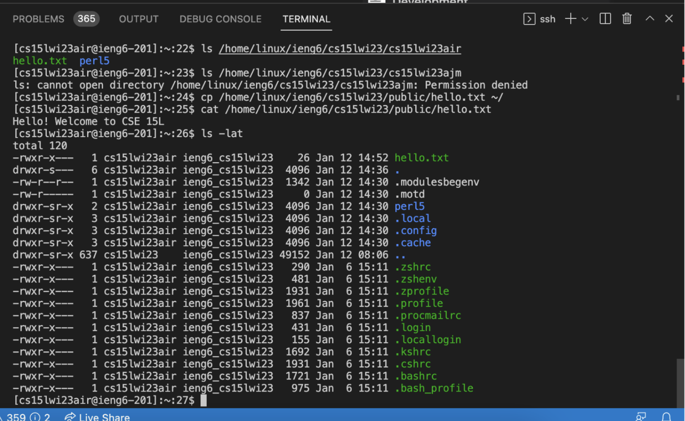

# WEEK 1 LAB REPORT


## STEP 1: Install Visual Studio Code

First visit the following link, https://code.visualstudio.com/, and follow steps to install on your own computer. I have a Mac computer, so I followed the corresponding steps. After installing and opening VScode, your screen should look like this:



I had previously downloaded VScode for a different program, so I skipped this first step for the lab.


## STEP 2: Remotely Connecting

Open a new terminal inside VScode (on my computer, click the "Terminal" option along the top of the screen, and click "New Terminal." 

Once in the terminal, type the following command: 

`$ ssh cs15lwi23abc@ieng6.ucsd.edu`

where the "abc" characters should be replaced by your own username (for me, cs15lwi23air). The "$" does not have to be copied in, just the text that follows. For those logging in for the first time, you may get this display message:

`The authenticity of host 'ieng6-202.ucsd.edu (128.54.70.227)' can't be established.
RSA key fingerprint is SHA256:ksruYwhnYH+sySHnHAtLUHngrPEyZTDl/1x99wUQcec.
Are you sure you want to continue connecting (yes/no/[fingerprint])?`

Go ahead and type "yes." Then, type in your password, and you should be connected. If your password is asked for again, you have inputted it wrong, and may need to try again. After successfully connecting to the remote server, this is what your screen should look like:



## STEP 3: Running Commands

Here are a list of commands to copy or type into the terminal: 

```
$ cd ~
$ cd
$ ls -lat
$ ls -a
$ ls /home/linux/ieng6/cs15lwi23/cs15lwi23air
$ cp /home/linux/ieng6/cs15lwi23/public/hello.txt ~/
$ cat /home/linux/ieng6/cs15lwi23/public/hello.txt
```

I messed around with the commands for a bit, and each time you type a new command into the terminal it will display the numbered command that you tried (can be seen in the screenshot below, `[cs15lwi23abc@ieng6-201]:~:XX`, where the XX denotes the numbered command).

I used the command `$ ls /home/linux/ieng6/cs15lwi23/cs15lwi23air`, which shows me the list of files in my own account directory. I then tried `$ ls /home/linux/ieng6/cs15lwi23/cs15lwi23ajm`, the command to show the list of files in another account directory, which I was unable to view as I did not have permission. The command `$ cat /home/linux/ieng6/cs15lwi23/public/hello.txt` prints out the contents of the hello.txt file, "Hello! Welcome to CSE 15L."



After completing all these steps, simply use Control + D to exit from the remote server.
